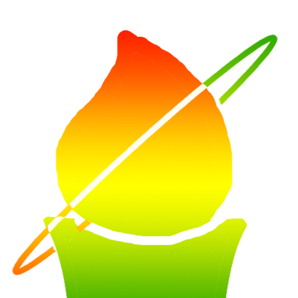

# heartful-runner-koki-api




### システム要件

- PHP 8.2 - 8.3
- Composer
- 参考: https://laravel.com/docs/11.x/releases

### セットアップ

```bash
$ composer install
$ cp .env.example .env
$ php artisan key:generate
$ touch database/database.sqlite
$ php artisan migrate
$ php artisan db:seed
$ php artisan serve
```

### ドキュメント

[API設計](api.md)
